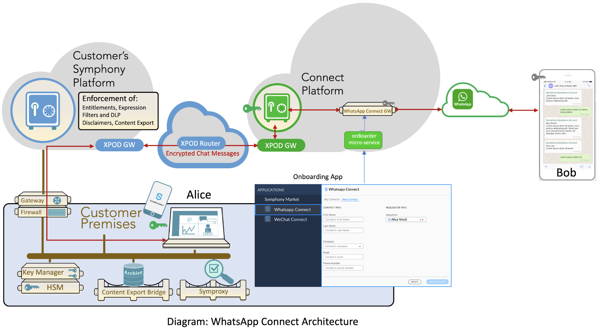

# WhatsApp Connect Architecture

### \*\*\*\*

The WhatsApp Connect architecture consists of a Symphony/WhatsApp gateway, provided via Symphony’s Connect platform, and an Onboarding App. The diagram also shows the Content Export Bridge used for retrieving the customer’s conversation history and the Symproxy used for DLP \(if implemented in your company\) and Malware Scanning \(if file attachments are activated for your company\).

