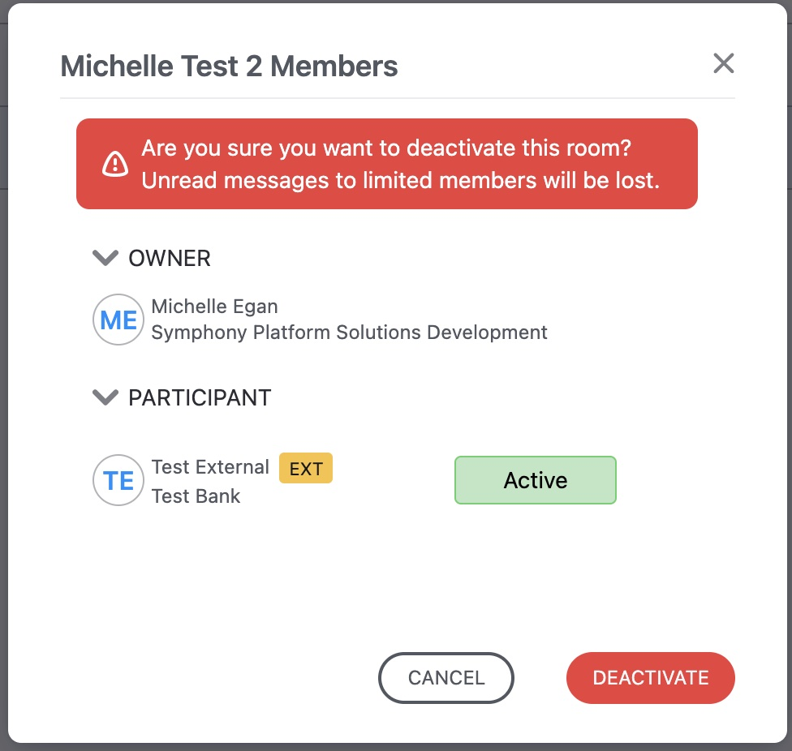

# Enable Advisors to Chat with Clients: Create and Manage Chat Rooms

## **Deactivate a Room**

A room can now be deactivated. This halts communications within it.

To deactivate a room, go to the ROOMS tab. Hover on the room name you want to deactivate to display the context menu \(three dots\). Select _Deactivate room_. An _Are you sure?_ window appears

## **Clients Can’t Add Participants to a Conversation**

If a WhatsApp client tries to create a group chat that includes a WhatsApp Connect advisor or conversation, the client will receive an error message.  

## **Find WhatsApp Connect Chats In Symphony**

To provide a high level of privacy between Symphony advisors and your clients, WhatsApp contacts are not exposed in the Symphony global directory. Only the advisor\(s\) who onboarded or are already connected to the client can see a client. This means:

* WhatsApp Connect clients are not searchable
* WhatsApp Connect clients cannot be @mentioned

#### Find a chat on desktop

On the Symphony desktop, if you need to quickly find  a WhatsApp conversation, use the Filter List option at the top of the navigation bar. In the filter list: 

* To find a specific client, type the name of the individual 
* To display all your WhatsApp contacts, type ‘\[WHATSAPP\]’; 

#### Find a chat on mobile

Search on mobile does _not_ display your WhatsApp contacts.   
On mobile, scroll down through your conversations until you find the one you want. 

#### **Find a Hidden chat**

On the Symphony desktop, you can hide a chat in the navigation bar. To unhide a chat, simply use the Filter List option at the top of the navigation bar to search for the client by typing the client's name.  

