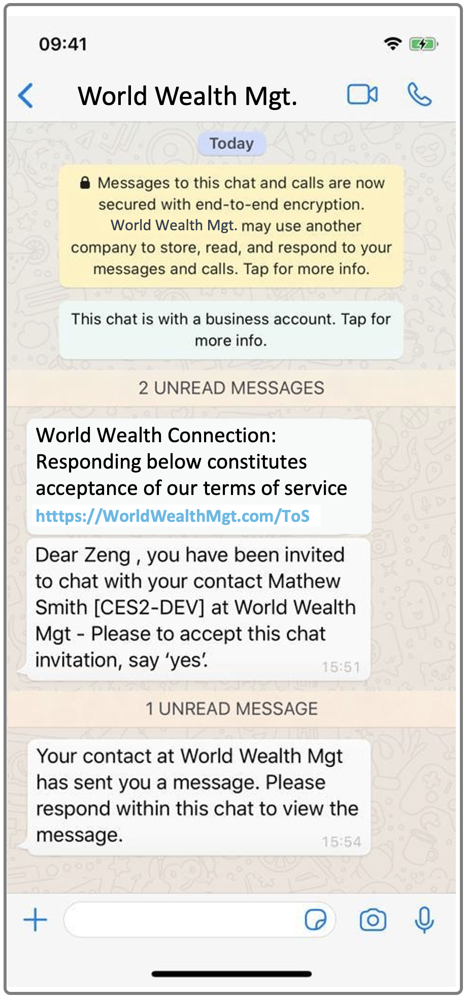

# Enable Advisors to Chat with Clients: Onboarding Clients

When an advisor has been entitled and enabled for WhatsApp Connect, the app appears in the Applications section at the bottom of the navigation bar of the advisor's Symphony Desktop Application. 

The advisor clicks WhatsApp Connect to open the app. Two tabs display:

* CONTACTS displays the WhatsAppConnect clients the advisor is connected with. If the advisor has permission, this tab is also used for onboarding and managing clients. 
* ROOMS lists the WhatsAppConnect rooms the advisor is part of. If the advisor has permission, this tab is also used for creating and managing rooms.

Before your advisors can chat with clients using WhatsApp Connect, the client\(s\) must be onboarded and a chat room must be created, as explained below. 

## WhatsApp Connect Starter Guide 

The [WhatsApp Connect Starter Guide](https://goto.symphony.com/rs/945-HBF-959/images/SYM_2021_1PGR_WhatApp_Starter_Guide.pdf) explains the basics of how advisors:

* connect with Symphony Connect Helper Bot. this connection must be established in order for advisors to create and manage contacts and rooms.
* add client contacts
* create rooms
* add a user to a room
* remove a user from a room

The [WhatsApp Connect Starter Guide](https://goto.symphony.com/rs/945-HBF-959/images/SYM_2021_1PGR_WhatApp_Starter_Guide.pdf) also describes your clients' process when they receive and respond to an advisor's invitation to join WhatsApp Connect.

## **Onboarding on Behalf of Others** 

WhatsApp Connect’s onboarding app allows designated users at your company to onboard a client on behalf of another user using the Requestor field on the New Contact form, pictured below. Some organizations prefer this approach rather than providing all users access to the onboarding app.

## One-step Onboarding: Create a Chat Room when you add a Client

On the New Contact form, advisors can check the ‘Create room with this contact’ box to launch a conversation with the client at the same time they onboard. 

## **Your Conversations and the 24-hour Anti-Spam Rule**

To help prevent unsolicited IMs being sent to WhatsApp users, Facebook has built an anti-spam mechanism into WhatsApp. Any unsolicited IM sent to a WhatsApp user – the invitation message your advisor sends to your client in this case – must receive a response from that user before a second message will be delivered for any 24-hour period of silence from the WhatsApp user \(your client\).   
****

Therefore, you may experience a delay when first chatting with a new client. The 24-hour rule means that after your invitation has been sent to your client, they must respond to it before an actual message from you will be sent to them.  
****

If you do decide to send a message before your client responds to the initial invitation, your client will see your invitation message followed by a notification that your message is waiting for them once they accept your invitation \(as shown below\):

  
  

## **Connect to Clients Already Using WhatsApp Connect**

If a client has already been onboarded on WhatsApp Connect by an advisor at your company or someone at another company, you simply need to add their details in the New Contact form as normal. As long as the email and phone number entered is _exactly the same_ as the contact information provided when they were onboarded, they will be automatically added to your list.

**Please note:** You may receive an error indicating that an email or phone number exists in the system already. This means that you have entered either the client’s email or phone number correctly but have entered the other value incorrectly. The system requires both values – email and phone number –  to be identical to those entered during onboarding.  

